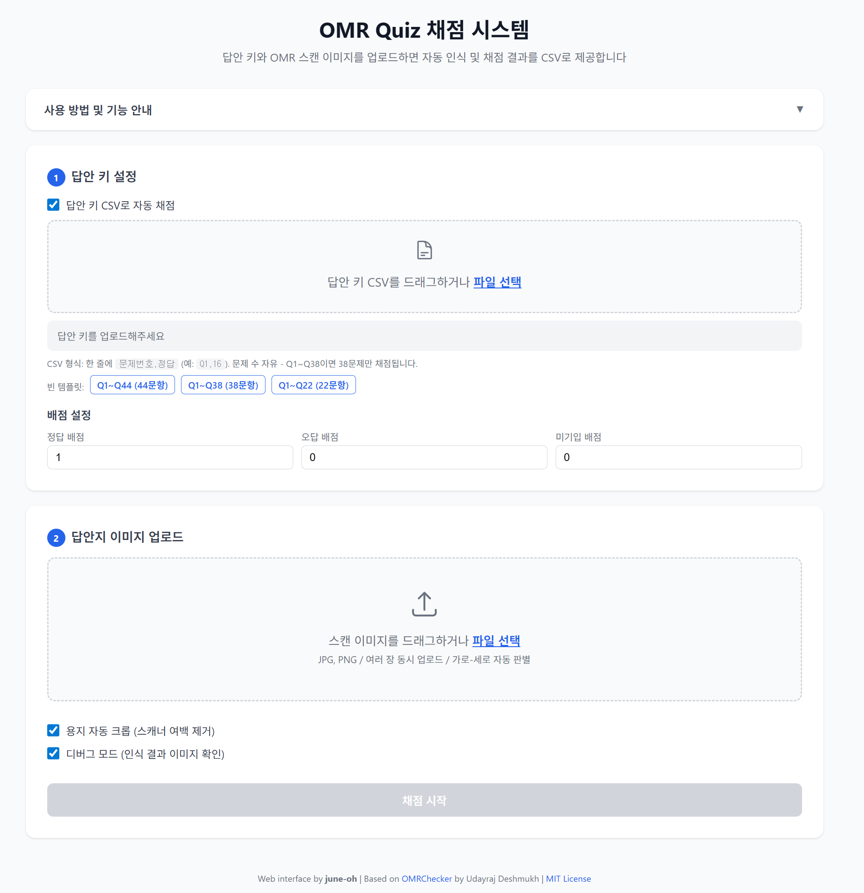

# Speech Lab OMR Check

OMR 답안지를 웹에서 업로드하면 자동으로 인식하고 채점하여 CSV 결과를 제공하는 원스톱 시스템입니다.

> **원본 프로젝트:** [OMRChecker](https://github.com/Udayraj123/OMRChecker) by Udayraj Deshmukh를 fork하여, 웹 기반 인터페이스와 이미지 처리 파이프라인을 추가 개발하였습니다.



---

## 주요 기능

| 기능 | 설명 |
|------|------|
| **웹 기반 UI** | 브라우저에서 드래그앤드롭으로 이미지 업로드, 결과 확인, CSV 다운로드 |
| **용지 자동 크롭** | 3개 코너 마커를 감지하여 OMR 용지 영역만 자동 정렬 및 크롭 |
| **컬러 드롭아웃** | 빨간색 인쇄 템플릿이 마킹으로 오인식되지 않도록 max(B,G,R) 기법으로 컬러 잉크 제거 |
| **가로/세로 자동 판별** | 세로 이미지는 양방향 회전 시도 후 최적 방향을 자동 선택 (마커 검출 + 학번 인식률 기반) |
| **답안 키 CSV 채점** | 답안 키 CSV 업로드 시 자동 채점 (정답/오답/미기입 배점 설정 가능) |
| **선행 0 무시** | `08`과 `8`을 동일한 정답으로 인정 |
| **가변 문제 수** | 답안 키 CSV에 있는 문제만 채점 (Q1~Q38이면 38문제만) |
| **디버그 모드** | 결과 테이블 행 클릭 시 전체 처리 과정을 단계별로 확인 (원본→회전→마커검출→Affine→전처리→최종결과) |
| **빈 답안 키 템플릿** | 44/38/22문항 빈 CSV 템플릿 다운로드 제공 |
| **다양한 스캐너 지원** | 마커 크기 자동 조정 (30~120px)으로 여러 스캐너 호환 |

---

## 설치

### 요구사항

- Python 3.8+
- pip

### 설치 방법

```bash
pip install -r requirements.txt
```

---

## 실행

```bash
python3 web_app.py
```

브라우저에서 `http://localhost:5000` 으로 접속합니다.

### 템플릿 편집기

버블 위치를 시각적으로 확인하고 직접 수정할 수 있습니다:

```
http://localhost:5000/template-editor
```

**기능:**
- 템플릿 JSON 실시간 편집
- 버블 위치 시각화 (빈 캔버스에 녹색 사각형 표시)
- JSON 포맷 자동 정리
- 저장 시 자동 백업 생성
- 통계 표시 (페이지/버블 크기, Field Block 수)

---

## OMR 답안지 인쇄

`template/44_questions.pdf` 파일을 인쇄하면 바로 사용할 수 있는 OMR 답안지가 됩니다.

- **44문항** (Q1\~Q44), 각 문항 2자리 숫자 응답 (00\~99)
- **학번 9자리** 기입란 포함
- **3개 코너 마커** (자동 크롭/정렬에 사용)
- 빨간색 인쇄 권장 (컬러 드롭아웃으로 인쇄 잔상 자동 제거)

> 인쇄 후 학생들이 답안을 마킹하고, 스캐너로 스캔한 이미지를 웹에 업로드하면 됩니다.

---

## 사용 방법

### Step 1: 답안 키 설정

1. **빈 템플릿 다운로드**: 44/38/22문항 중 선택하여 빈 CSV 다운로드
2. **정답 입력**: 다운로드한 CSV에 정답 기입 (예: `Q1,16`)
3. **업로드**: 완성된 CSV를 드래그하거나 파일 선택으로 업로드
4. **배점 설정**: 정답/오답/미기입 각각의 점수 지정

답안 키 CSV 형식 (헤더 없음):
```csv
Q1,16
Q2,17
Q3,8
...
Q44,36
```

### Step 2: 스캔 이미지 업로드

1. 스캐너에서 출력된 OMR 답안지 JPG/PNG 이미지를 드래그하거나 파일 선택
2. 여러 장 동시 업로드 가능
3. 옵션 설정:
   - **용지 자동 크롭**: 스캐너 출력물에서 OMR 용지만 잘라냄 (기본 ON)
   - **디버그 모드**: 인식 결과 이미지를 확인할 수 있음 (기본 ON)

### Step 3: 결과 확인

- 통계: 처리 완료, 다중 마킹, 오류, 평균/최고/최저 점수
- 테이블: 학번(Num) + 각 문제 응답 + 정답(초록)/오답(빨강) 하이라이트
- 디버그: 행 클릭 시 OMR 버블 인식 이미지 팝업
- **CSV 다운로드** 버튼으로 전체 결과 다운로드

---

## 프로젝트 구조

```
speech_lab_OMR_check/
├── web_app.py              # Flask 웹 앱 (메인)
├── template/
│   ├── template.json       # OMR 레이아웃 템플릿 (버블 좌표 정의)
│   └── 44_questions.pdf    # 인쇄용 OMR 답안지 (44문항)
├── src/                    # OMRChecker 코어 모듈
│   ├── core.py             # 버블 감지 및 OMR 응답 읽기
│   ├── template.py         # 템플릿 파싱
│   ├── evaluation.py       # 채점 로직
│   ├── constants.py        # 상수 정의
│   ├── logger.py           # 로깅
│   ├── defaults/           # 기본 설정값
│   ├── processors/         # 이미지 전처리기 (Levels, GaussianBlur 등)
│   ├── schemas/            # JSON 스키마 검증
│   └── utils/              # 유틸리티 (이미지, 파싱, 파일)
├── requirements.txt        # Python 패키지 의존성
├── LICENSE                 # MIT License
└── README.md               # 이 파일
```

---

## 고급 설정

### 스캐너 호환성

시스템은 다양한 스캐너를 지원하며, 자동으로 크기를 보정합니다:

**정상 처리 (마커 기반):**
1. 3개 코너 마커 검출
2. Affine 변환으로 3507×2480 표준 크기로 정렬
3. 회전 및 왜곡 자동 보정

**Fallback 처리 (마커 없음):**
- 마커 검출 실패 시 aspect ratio를 유지하며 리사이즈
- 중앙 정렬 후 흰색 패딩 추가
- 인식률이 떨어질 수 있으므로 마커가 있는 용지 사용 권장

**테스트된 스캐너:**
- Origin Scanner: 3507×2480 (완벽 호환)
- Another Scanner: 3481×2458 (마커 기반 보정으로 완벽 처리)

### 버블 인식률 조정

인식률이 낮을 경우 `template/template.json` 파일의 `bubbleDimensions` 값을 조정할 수 있습니다:

```json
{
    "bubbleDimensions": [28, 45]
}
```

- **첫 번째 값 (가로)**: 버블의 가로 크기 (기본: 28)
- **두 번째 값 (세로)**: 버블의 세로 크기 (기본: 45)
- 값을 크게 할수록 인식 범위가 넓어져 흐릿한 마킹도 인식되지만, 너무 크면 오인식이 발생할 수 있습니다.
- 권장 범위: 가로 25~30, 세로 42~48
- **주의**: 페이지 크기를 초과하지 않도록 조정해야 합니다 (최대 가로: 30, 최대 세로: 48)

### 마커 검출 문제 해결

스캐너에 따라 마커 크기가 다를 수 있습니다. 마커 검출이 실패하는 경우:

1. **고해상도 스캔**: 300 DPI 이상 권장
2. **용지 정렬**: 스캔 시 용지가 기울어지지 않도록 주의
3. **대비 조정**: 스캐너 설정에서 대비를 높게 설정
4. **마커 상태**: 마커가 손상되거나 가려지지 않았는지 확인

현재 시스템은 30~120px 범위의 마커를 자동으로 검출합니다.

---

## OMR 처리 파이프라인

```
스캔 이미지 (JPG/PNG - 컬러)
    │
    ▼
[레드 드롭아웃] max(B,G,R) + 빨간 픽셀→흰색(255) → 흑백 변환
    │
    ▼
[세로/가로 판단] height > width → 90도 강제 회전 (가로로 만들기) ⭐
    │
    ▼
[마커 검출] 3개 코너 마커 검출 (왼쪽 위, 오른쪽 위, 오른쪽 아래)
    │
    ▼
[마커 방향 확인] 마커 배치 분석 → 추가 회전 필요 여부 판단
    │
    ▼
[Affine 변환] 마커 바깥쪽 기준 정렬 + 크롭 → 3507×2480 표준화
    │
    ▼
[전처리] Levels (대비 강화) → GaussianBlur (노이즈 제거)
    │
    ▼
[버블 감지] 각 버블 영역 밝기 계산 → 임계값 비교 → 마킹 판정
    │
    ▼
[응답 결합] roll_1~9 → 학번, Q1_1+Q1_2 → Q1 등
    │
    ▼
[채점] 답안 키 대조 → 정답/오답/미기입 판정 → 점수 산출
    │
    ▼
결과 CSV + 웹 테이블 + 디버그 이미지
```

**⭐ 핵심 개선**: 세로 이미지를 먼저 가로로 회전한 후 마커 검출 → Affine 변환 시 삼각형 문제 완전 해결

### 디버그 모드 세부 단계

디버그 모드를 활성화하면 다음 단계별 이미지를 확인할 수 있습니다:

1. **원본 이미지**: 업로드된 원본 컬러 스캔 이미지
2. **레드 드롭아웃**: max(B,G,R) + 빨간 픽셀→흰색 → 흑백 변환
3. **회전 보정**: 세로 이미지 → 90도 강제 회전 (가로로 만들기) ⭐
4. **마커 검출**: 3개 코너 마커 검출 및 표시 (왼쪽 위, 오른쪽 위, 오른쪽 아래)
5. **Affine 변환**: 마커 바깥쪽 기준 정렬 및 크롭 → 3507×2480 표준화
6. **전처리 완료**: Levels (대비 강화) + GaussianBlur (노이즈 제거)
7. **템플릿 버블 위치**: 인식할 버블 위치를 녹색 사각형으로 표시
8. **최종 인식 결과**: 버블 인식 및 마킹 표시, 정답/오답 하이라이트

**Fallback 단계** (마커 검출 실패 시):
- Fallback 리사이즈: Aspect ratio 유지하며 3507×2480 강제 변환
- 최종 크기 보정: 크기 불일치 시 추가 보정

**⭐ 핵심**: 세로 이미지를 먼저 가로로 회전 → 마커 검출 → Affine 변환이 정상 작동

---

## 라이선스

MIT License - 자세한 내용은 [LICENSE](LICENSE) 파일을 참조하세요.

이 프로젝트는 [OMRChecker](https://github.com/Udayraj123/OMRChecker) (MIT License, Copyright (c) 2024-present Udayraj Deshmukh)를 기반으로 합니다. 웹 인터페이스 및 이미지 처리 개선은 june-oh가 개발하였습니다.
